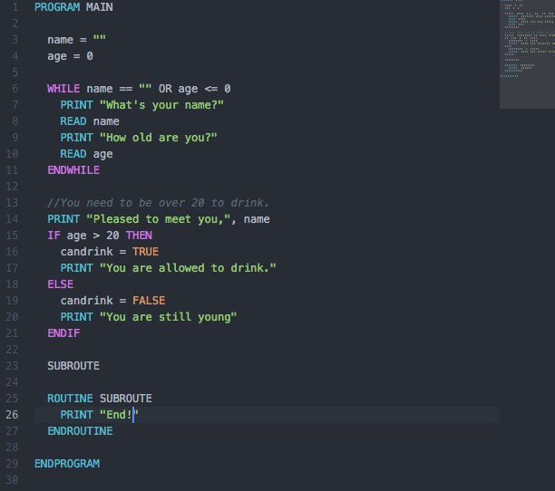

# language-pseu package

A very simple pseudocode language definition and syntax highlighter.

By default, reads ```*.pseudo``` and ```*.pseudocode``` files.



## Syntax

__Control statements__

```pseudo

IF, ENDIF, ELSE, ELSEIF, THEN, SELECT, CASE, ENDCASE, BREAK, RETURN, WHILE, ENDWHILE, DOWHILE, ENDDO, REPEAT, UNTIL, TO, END

```

__Function-like__

```pseudo

FUNCTION, ENDFUNCTION, SUB, ENDSUB, ROUTINE, ENDROUTINE, PROGRAM, ENDPROGRAM

```

__Logical operators__

```pseudo

AND, OR, NOT

```

__Boolean operators__

```pseudo

TRUE, FALSE

```

__Functions__

```pseudo

PRINT, READ, GET, FROM, WRITE, PUT

```

__Strings__

```pseudo

Either " or ',

I.e.

name = 'isdampe'
name = "isdampe"

```

__Comments__

```pseudo

//

I.e, //this is a comment

```
